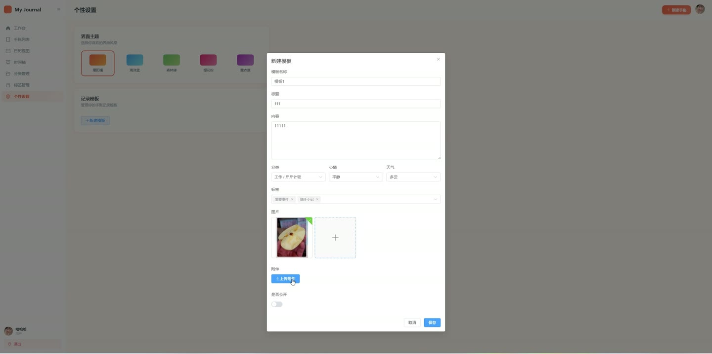
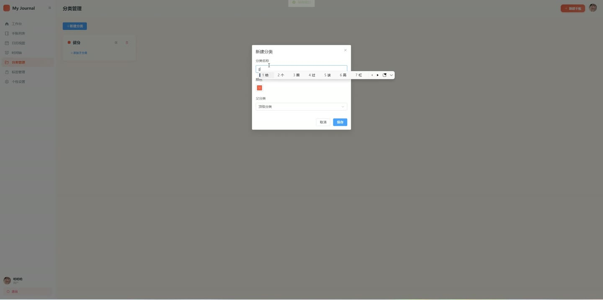
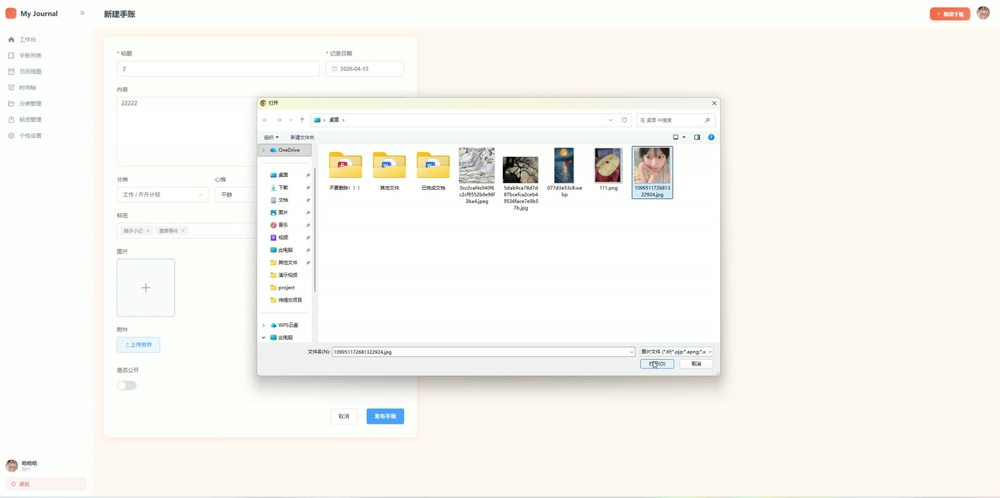
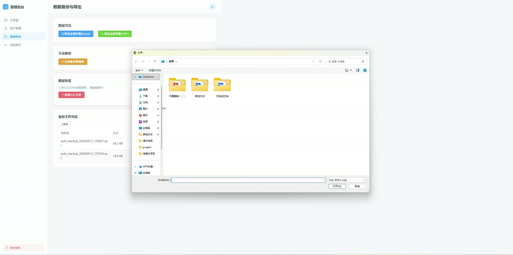
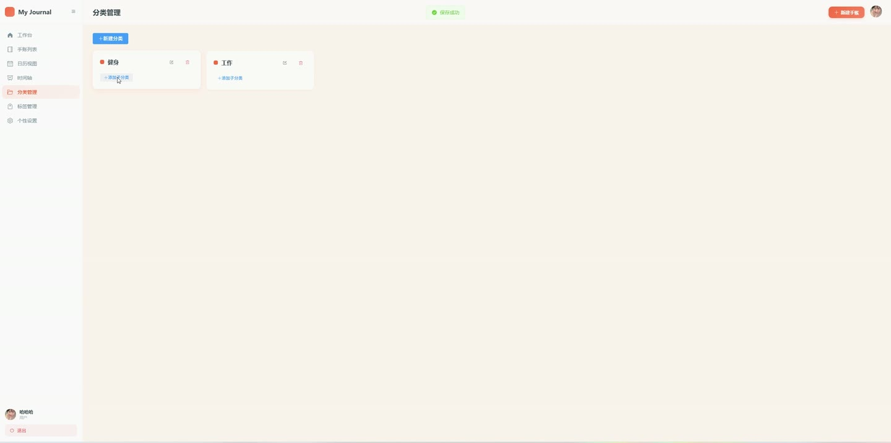

# (附文档)Springboot3+Vue3+MySQL 个人收账管理系统

**技术栈**：Springboot3、Vue3、MySQL

### 系统简介

个人收账管理系统是一套基于 SpringBoot3 + Vue3 前后端分离架构的现代化手账管理平台。系统支持用户注册登录、手账的增删改查、多媒体附件上传、多级分类与标签管理、日历视图与时间轴浏览、数据导出备份与恢复，同时提供管理员后台对用户进行管理。系统包含普通用户和管理员两种角色，覆盖从个人记录到系统运维的完整链路。
 
### 核心功能
 
### 普通用户端

 
- 用户注册与登录：通过用户名/密码注册账号，登录后返回 JWT Token 用于后续鉴权。 
- 手账列表分页查询：支持按关键词（标题/内容）、分类、起始日期、结束日期进行多条件筛选分页。 
- 手账详情查看：获取单条手账的完整信息，同时返回关联的标签 ID 列表和分类 ID 列表。 
- 新增手账：填写标题、内容、心情、天气、图片、附件、分类（支持多级分类 ID 字符串）、公开状态、记录日期，并关联多个标签。 
- 编辑手账：修改手账所有字段，同时重新设置关联标签（先删除原有关联再插入新标签）。 
- 删除手账：删除手账记录及其关联的 journal_tag 中间表数据。 
- 日历视图数据：根据起止日期范围查询该用户的手账记录，用于前端日历展示。 
- 时间轴数据：获取该用户所有手账列表（按记录日期倒序），用于时间线浏览。 
- 分类管理：新增、编辑、删除分类，支持父级分类（parentId）实现多级分类结构，按 sortOrder 排序。 
- 分类列表查询：获取当前用户的所有分类；根据父分类 ID 获取子分类列表。 
- 标签管理：新增、编辑、删除标签，标签包含名称和颜色字段。 
- 标签列表查询：获取当前用户的所有标签。 
- 手账模板管理：新增、编辑、删除模板，模板包含标题、内容、心情、天气、分类、标签、公开状态、图片、附件等预填内容。 
- 模板列表查询：获取当前用户的所有手账模板。 
- 个人资料查看：获取当前登录用户的基本信息（用户名、昵称、头像、邮箱、手机号、角色、主题）。 
- 个人资料编辑：修改昵称、邮箱、手机号、头像、主题等字段。 
- 修改密码：校验原密码后更新为新密码。 
- 头像上传：上传头像图片文件，保存至本地目录并更新用户头像字段。 
- 图片/文件上传：支持上传图片和普通文件，返回可访问的 URL 地址。 
- 个人数据导出 Excel：将当前用户的所有手账导出为 .xlsx 文件（包含标题、内容、心情、天气、记录日期、创建时间）。 
- 个人备份管理：创建手动备份（导出 Excel 并记录备份记录）、查看备份列表、下载备份文件、删除备份。
 
### 管理员端

 
- 用户列表分页查询：支持按用户名/昵称/邮箱关键词模糊搜索，分页返回用户列表。 
- 用户状态切换：启用或禁用指定用户账号（status 字段在 0/1 之间切换）。 
- 删除用户：根据用户 ID 删除用户记录。 
- 编辑用户信息：修改用户的昵称、邮箱、手机号等基本信息（不修改密码）。 
- 系统统计概览：获取总用户数和总手账数。 
- 用户手账统计：列出每个用户的 ID、用户名、昵称及其手账数量。 
- 全局数据导出 Excel：将系统所有手账（含用户信息）导出为 .xlsx 文件。 
- 全局数据导出 PDF：将系统所有手账（含用户信息）导出为 PDF 文件。 
- SQL 备份管理：执行自动备份（调用 mysqldump 生成 .sql 文件）、查看备份文件列表（文件名、大小、修改时间）、下载备份文件、删除备份文件。 
- SQL 恢复：上传 .sql 文件并通过 mysql 命令恢复数据库。
 
### 技术栈

 后端框架Spring Boot 3.2 ORMMyBatis-Plus 3.5.5 权限认证Spring Security + JWT 密码加密BCryptPasswordEncoder 前端框架Vue 3 (Composition API) 前端路由Vue Router 4 (createWebHistory) 状态管理Pinia UI 组件库Element Plus 构建工具Vite 数据库MySQL 8.0 Excel 导出Apache POI (XSSFWorkbook) PDF 导出iText 7 文件上传MultipartFile + 本地存储
 
### 交付内容

 
- 后端完整源码 
- 前端完整源码 
- 数据库初始化脚本 
- 万字文档

## 界面展示

---

## 获取完整源码 + 万字文档

本仓库为项目介绍页。**完整前后端源码、数据库初始化脚本、万字项目文档**，请加微信 `kangkangcode`，或访问 [codekk.top](http://codekk.top) 获取。

可作课程设计 / 毕业设计参考，支持远程部署调试。